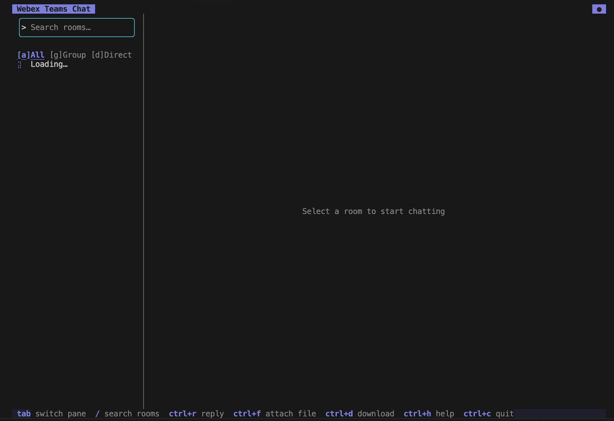

[](https://en.wikipedia.org/wiki/Open_source)
[](https://golang.org)
[](https://goreportcard.com/report/github.com/tejzpr/webex-teams-cli)
[](https://gitpod.io/#https://github.com/tejzpr/webex-teams-cli)
[](https://github.com/tejzpr/webex-teams-cli/actions/workflows/codeql-analysis.yml)

# Webex-Teams-CLI - A CLI tool to interact with Cisco Webex Teams.

## The What?
Webex Teams CLI is a versatile tool that works via Webex Teams API to interact with Webex Teams. It currently has the following features
1. Send messages
2. Broadcast to multiple rooms
3. Send Files
4. Manage a Webex team room 
5. Add / Remove users from Webex Teams room in bulk
6. A message relay server than can be hosted as a microservice allowing other services to send messages to Webex Teams.
7. Create an Onboarding Server that can onboard users via the website. 
8. **Modern Chat TUI** — a two-pane terminal chat interface with room sidebar, threaded conversations, inline image viewing, file attachments, and real-time WebSocket messaging. Works over SSH.
9. *Experimental* Start this up as a control center on a remote server and control the remote server via Webex Teams.
10. Capability to run on many architectures including Linux x86_64, Linux Arm64, Darwin (MacOs x86_64, Arm64), Windows etc. without any external dependencies. I've tested it on Alpine Linux, Raspberry PI, MacOs, Windows.

## The Why?
This tool was born out of a necessity to send notifications to Webex Teams from CI/CD pipelines. Over time it has grown in capability and function therefore putting this out to the public to use / expand.

## Usage:
Set Env variable **WEBEX_ACCESS_TOKEN**, which can get retrieved from [https://developer.webex.com/docs/api/getting-started](https://developer.webex.com/docs/api/getting-started)

```sh
export WEBEX_ACCESS_TOKEN="<access_token>"
```

Send a text message (message supports markdown formatting)
```sh
webex-teams-cli room msg -t "message text" 
```

Send a text message (message supports markdown formatting) along with a file. File can be a remote http URL or a locally accessible file.
```sh
webex-teams-cli room msg -t "message text" -f <file>
```
### Using Docker:
Send a text message using the docker image
```docker
docker run -it ghcr.io/tejzpr/webex-teams-cli:main webex-teams-cli --accessToken <access-token> room --pe user@email.com msg -t "a test message"
```
Send a file _test.txt_ using docker
```docker
docker run -it -v /testdir:/testdir  ghcr.io/tejzpr/webex-teams-cli:main webex-teams-cli --accessToken <access-token> room --pe user@email.com msg -f /testdir/test.txt
```
Find the room details for a title
```docker
docker run -it ghcr.io/tejzpr/webex-teams-cli:main webex-teams-cli --accessToken <access-token> utils findroom -t "Room Name"
```
## Find the room details for a title
-----------------------------------------
```sh
webex-teams-cli --accessToken <access-token> utils findroom -t "Room Name"
```
## Send a message based on room ID
-----------------------------------------
Set Env variable **WEBEX_ROOM_ID**, is the Space ID that you can get by visiting https://teams.webex.com/ and clicking on a room.
```sh
export WEBEX_ROOM_ID="<roomid>"
```

Then you can send a message to the room by running the command

```sh
webex-teams-cli room msg -t "message text" 
```

**OR**

Use roomID flag to set the room ID
```sh
webex-teams-cli room -roomID <ROOMID> msg -t "message text" -f <file>
```

## Send a message to a Person based on Email address
-----------------------------------------
Set Env variable **WEBEX_PERSON_EMAIL**
```sh
export WEBEX_PERSON_EMAIL="<EMAILID>"
```

Then you can send a message to the room by running the command

```sh
webex-teams-cli room msg -t "message text" 
```

**OR**

Use toPersonEmail flag to set the person email ID
```sh
webex-teams-cli room -toPersonEmail <person@email.com> msg -t "message text" -f <file>
```

Distribution archive Includes executables for Linux amd_x64, Linux ARM5, Windows & Darwin (MacOS)

## Export Members form a room
Allows to export members of a room into a CSV file
```sh
webex-teams-cli room --roomID <roomID> exportmembers --csv ./members.csv 
```
## Add Members to Room(s)
Allows to add multiple members to room(s). The member list can be passed via a .csv file with the header & data
email,moderator where email is a string and moderator acceps true/false
eg.
```people.csv
email,moderator
a@email.com,true
b@email.com,false
```
Members will be added to rooms for which you have specified permissions of either 'a' (all), 'o' (owner), 'm' (moderator) or 'om' (owner and moderator). Default is owner and moderator use the --access flag to change this.

then run the command 
```sh
webex-teams-cli room --roomID <roomID> addmembers --csv ./people.csv --access om
```
if you would like to add members to a list of rooms specified by a csv file then run
```sh
webex-teams-cli room addmembers --csv ./people.csv --roomsidscsv ./rooms.csv
```
where roomsidscsv has the following format:
```csv
roomids
<roomid-1>
<roomid-2>
```
if you would like to add members to all rooms that you have moderator access to, skip the roomID parameter
```sh
webex-teams-cli room addmembers --csv ./people.csv 
```
## Remove Members from Room(s)
Allows to remove multiple members from room(s). The member list can be passed via a .csv file with the header & data
"email" where email is a string.
eg.
```people.csv
email
a@email.com
b@email.com
```
Members will be removed from rooms for which you have specified permissions of either 'a' (all),  'o' (owner), 'm' (moderator) or 'om' (owner and moderator). Default is owner and moderator use the --access flag to change this.

then run the command 
```sh
webex-teams-cli room --roomID <roomID> removemembers --csv ./people.csv --access om
```
if you would like to remove members from a list of rooms specified by a csv file then run
```sh
webex-teams-cli room removemembers --csv ./people.csv --roomsidscsv ./rooms.csv
```
where roomsidscsv has the following format:
```csv
roomids
<roomid-1>
<roomid-2>
```
if you would like to remove members from all rooms that you have moderator access to, skip the roomID parameter
```sh
webex-teams-cli room removemembers --csv ./people.csv 
```
## Broadcast a Message or a File to a set of rooms (File broadcast will be slow, do not use for large files)
Members will be removed from rooms for which you have specified permissions of either 'a' (all),  'o' (owner), 'm' (moderator) or 'om' (owner and moderator). Default is owner and moderator use the --access flag to change this.

then run the following command to broadcast a text
```sh
webex-teams-cli room broadcast --roomsidscsv ./rooms.csv --t "message text"
```
to broadcast a file
```sh
webex-teams-cli room broadcast --roomsidscsv ./rooms.csv --f <file-path>
```
To broadcast to all rooms that you are a member of use the --access a flag
```sh
webex-teams-cli room broadcast --t "message text" --access a
```
## Shell command execution mode

**Use this mode at your own risk. This mode allows selected users system level access to remote machines through Webex**

Allows users to start up the CLI in a remote machine and then execute commands on the remote machine via Webex Teams.

**WEBEX_ACCESS_TOKEN has to be a BOT (not a USER) token to use the shell command execution mode.**

Add a bot to a Webex room and provide its access token to WEBEX_ACCESS_TOKEN, then run
```sh
webex-teams-cli shell --pes email-1@email.com,email-2@email.com --rid <roomID>  
```
Now you can interact with the BOT from the Webex Room. To view help send the *help* command from the Webex Room.
To execute a command on the remote server on which the CLI is running send the command  *cmd <command and params>* from the webex room.

## Interactive Chat TUI
-----------------------------------------
Launch a modern, full-featured terminal chat interface with a two-pane layout (sidebar + chat).

**WEBEX_ACCESS_TOKEN has to be a USER (not a BOT) token.**
```sh
webex-teams-cli chat
```



### Features
- **Two-pane layout** — persistent room sidebar on the left, chat pane on the right
- **Room search & filter** — type `/` to search rooms, press `a`/`g`/`d` to filter by All/Group/Direct
- **Real-time messaging** — WebSocket-based live message delivery
- **Threaded conversations** — reply in-thread with `Ctrl+R`, thread replies are grouped and indented
- **File attachments** — send files with `Ctrl+F` (opens a file picker), attachment filenames are resolved automatically
- **Image viewer** — press `Ctrl+D` on an image attachment to view it inline in the terminal (halfblocks/sixel/kitty auto-detected via [go-termimg](https://github.com/blacktop/go-termimg))
- **File download** — press `Ctrl+D` on any attachment to save it to a local directory via a directory picker
- **Works over SSH** — no GUI required, all rendering is terminal-native

### Keyboard Shortcuts
| Key | Action |
|---|---|
| `Tab` | Switch between sidebar and chat pane |
| `/` | Focus room search |
| `a` / `g` / `d` | Filter rooms: All / Group / Direct |
| `Enter` | Send message / Select room |
| `Ctrl+R` | Reply in thread to selected message |
| `Ctrl+F` | Attach a file (opens file picker) |
| `Ctrl+D` | Download/view attachment on selected message |
| `Ctrl+H` | Toggle help |
| `Ctrl+C` | Quit |
| `Esc` | Cancel reply / close overlay |
| `↑` / `↓` | Navigate rooms or messages |

### Image Viewer
When viewing an image attachment (`Ctrl+D`), an overlay appears with the rendered image:
- Press **`Esc`** to close the image viewer
- Press **`s`** to save the image to a local directory

### File Picker (Send / Save)
- **Send mode** (`Ctrl+F`): navigate directories, press `Enter` to select a file to send
- **Save mode** (`Ctrl+D` on non-image files, or `s` from image viewer): navigate to a directory, press `s` to save the file there

## Legacy Interactive Prompt
-----------------------------------------
The legacy interactive prompt is still available:
```sh
webex-teams-cli room --i true msg
```
Or to directly open a room
```sh
webex-teams-cli room --pe email@email.com --i true msg
```
To send a file via interactive prompt use the **sendfile** command
```
<- (email@email.com): sendfile <file-path or URI>
```

## Use run.sh to start in interactive mode
Run the shell script run.sh and follow the prompts


## Console prompt (in case system doesn't support interactive mode)
Allows users to start up the CLI in an interactive (console) mode on a remote machine and communicate to Webex from the remote machine.

**WEBEX_ACCESS_TOKEN has to be a USER (not a BOT) token to use the console prompt.**
```sh
webex-teams-cli room --pe email@email.com --c true msg
```
To send a file via console prompt use the **sendfile** command
```
<- (email@email.com): sendfile <file-path or URI>
```
## Create Webex Room Onboarding Server
Create a server which can onboard users to a Webex Teams room. The user to be added is retrieved via the header **auth_user**
The email address of the user is constructed using a combination of auth_user & the emaildomain flag. The server's default port is **8000** and it can be changed by using the -p flag
```sh
webex-teams-cli adduserserver -emaildomain email.com
```
Once the server is UP a user can add themselves to a room by accessing
```
GET http://<url>/<webexroomid>
```
## Create a message relay server 
Create a message relay server send messages to a Webex Teams room 
```sh
webex-teams-cli messagerelayserver -messagerelaykey <random256lengthkey>
```
Once the server is UP a user can send messages to a room by calling the POST endpoint and sending a POST request containing the message body, and a Header **X-Message-Key** which should match the **messagerelaykey** used while starting the server.
```
POST http://<url>/<webexroomid>
```
